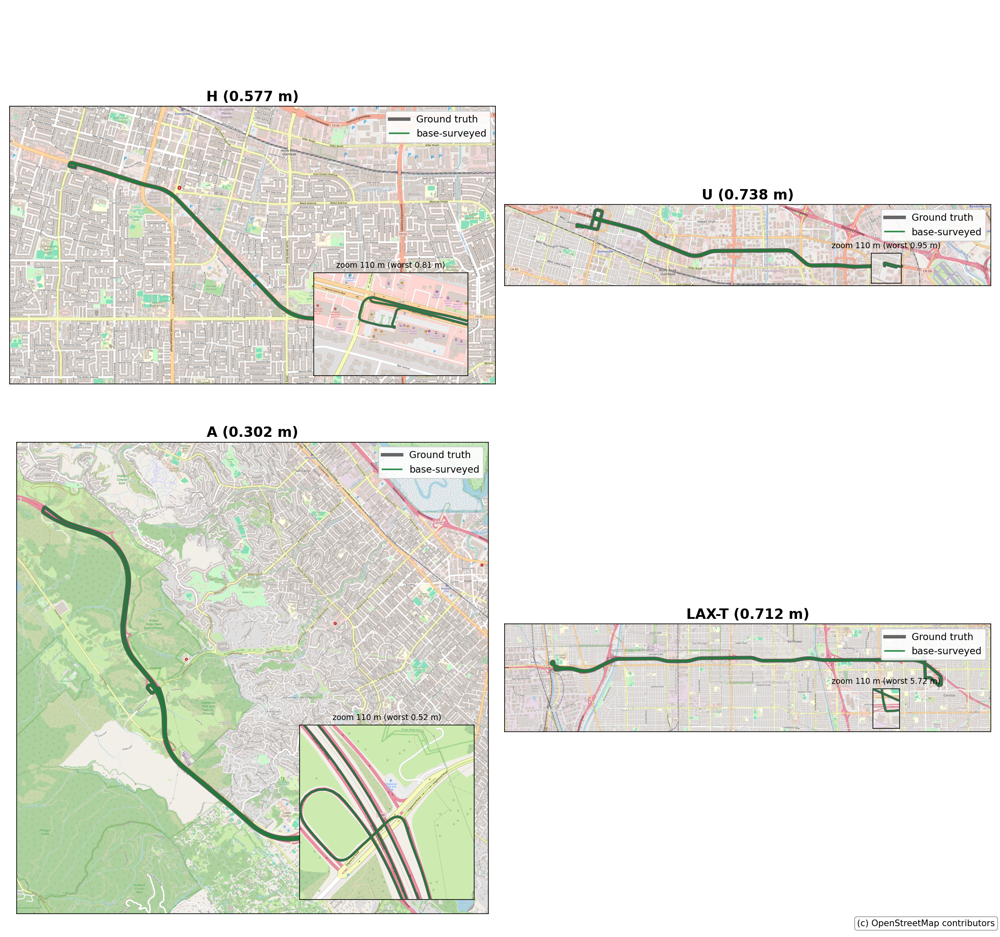

# libgnss++

Modern C++20 GNSS toolkit for non-GUI positioning.

Native `SPP`, `RTK`, `PPP`, `CLAS/MADOCA`, `RTCM`, `UBX`, and direct `QZSS L6`
handling without an external RTKLIB runtime.


## What You Get

- Solvers: `gnss spp`, `gnss solve`, `gnss ppp`
- Inputs/tools: RINEX, RTCM, UBX, SBF, NMEA, BINEX, QZSS L6
- Products: `SP3`, `CLK`, `IONEX`, `DCB`
- Extras: benchmarks, web dashboard, Python bindings, Docker, ROS 2 playback

[Choose a use case](docs/use_cases.md): [urban RTK + IMU continuity](docs/use_cases/urban_rtk_fgo.md),
[RTKLIB migration](docs/use_cases/rtklib_migration.md),
[ROS2 receiver/bag replay](docs/use_cases/ros2.md), or [QZSS L6 / CLAS / MADOCA](docs/use_cases/qzss_l6.md).


## Try it

The fastest first run uses the published runtime image; no local build is
needed:

```bash
mkdir -p output
docker run --rm \
  -v "$PWD/output:/workspace/output" \
  ghcr.io/rsasaki0109/gnssplusplus-library:v0.2.0 \
  demo --output-dir /workspace/output/self-contained-demo
```

The command runs the tracked, project-authored synthetic PPP fixture entirely
offline after the image is available. It should report 8 processed and 8 valid
PPP solutions and write `demo_solution.pos`, `demo_solution.kml`, and
`demo_summary.json` under `output/self-contained-demo/`. This validates
CLI/build/artifact plumbing, not field accuracy, real-world satellite
geometry, or RTK fix performance. See the [full demo guide](docs/self_contained_demo.md)
for provenance and native-build instructions.

Prefer a native source checkout? Build the PPP executable and run the same
tracked demo:

```bash
cmake -S . -B build -DCMAKE_BUILD_TYPE=Release
cmake --build build --target gnss_ppp --parallel 2
python3 apps/gnss.py demo
```

After the native demo, run `python3 apps/gnss.py next`. It validates the local
demo result and gives one copy-paste next command for SPP, RTK, PPP, ROS2,
QZSS, or C++ integration. The check is local; it does not transmit or store
usage data. After a standard SPP, RTK, or PPP output is created, the same
command validates that it contains solution epochs and advances to a KML
inspection step. Installed builds expose the command as `gnss next`.

## Use the C++20 library

The install exports a standard CMake package and the `libgnsspp::gnss_lib`
target for downstream C++20 applications:

```cmake
cmake_minimum_required(VERSION 3.14)
project(my_gnss_app LANGUAGES CXX)

set(CMAKE_CXX_STANDARD 20)
set(CMAKE_CXX_STANDARD_REQUIRED ON)

find_package(libgnsspp CONFIG REQUIRED)
add_executable(my_gnss_app main.cpp)
target_link_libraries(my_gnss_app PRIVATE libgnsspp::gnss_lib)
```

Build the complete exported library set before installing it:
`cmake --build build --parallel 2`, followed by
`cmake --install build --prefix <prefix>`. Configure the consumer with
`-DCMAKE_PREFIX_PATH=<prefix>`. Start with the
[simple SPP example](examples/simple_spp.cpp), the
[RTK positioning example](examples/rtk_positioning.cpp), the
[public API header](include/libgnss++/gnss.hpp), and the
[interface notes](docs/interfaces.md).

See the [v0.2.0 release highlights](docs/releases/v0.2.0.md) and
[maintainer release runbook](docs/release_runbook.md) for distribution details.

## Results And Validation Status

| Area | Public comparison | Evidence / status |
|---|---|---|
| RTK | PPC Tokyo/Nagoya vs RTKLIB `demo5` | +17.0 pp positioning, +28.1 pp official score, -11.96 m P95 H delta |
| GNSS/IMU FGO | PPC Tokyo vs `tightly-coupled-gnss-imu-fgo` | Higher <50 cm fraction (avg +5.6 pp) and fix-rate (avg +8.2 pp) on all 3 runs; fixed-only RMS also wins 2 of 3 runs |
| CLAS PPP | Six PPC Tokyo/Nagoya runs vs MRTKLIB CLAS | 25.121% aggregate FIX, 0.359 m FIX RMS2D, and zero FIX epochs above 3 m across 58,259 scored epochs; every run passes the MRTKLIB v0.4.2 FIX-rate and FIX-RMS2D hard gates |
| Urban RTK | UrbanNav Tokyo Odaiba vs RTKLIB `demo5` | More fixes, lower Hp95/Vp95; `--preset odaiba` closes Hmed |
| SPP | PPC SPP adaptive robust + policy gate | No P95 regression with <=1 pp positioning drop |
| Smartphone GNSS/IMU | Raw-only native FGO, base-surveyed | Sub-meter on all 4 GSDC dev routes (0.30-0.74 m); not a leaderboard result |

### Smartphone GNSS/IMU

Base-surveyed correction on the GSDC dev routes (Pixel5, `(P50+P95)/2` m):

| route | H | U | A | LAX-T |
|---|---:|---:|---:|---:|
| base-surveyed | **0.577** | **0.738** | **0.302** | **0.712** |



Raw GNSS + IMU + broadcast nav only. Dev routes, not a Kaggle leaderboard
score. Details in the
[record](docs/use_cases/records/smartphone_base_surveyed_route_results_v1.md).

### PPC 2024 goal matrix vs Kaiyodai and gici-open

The audited KF/FGO selected profile clears the distance-weighted PPC public
target at **78.8455%** (published target: **78.7%**). It also exceeds the
Tokyo 1 public FIX rate (**80.861%** vs **80.8%**). A separate FIX-target
profile clears Nagoya 1 by the narrow measured margin **85.100974%** vs
**85.1%**, with 0.913% Wrong FIX/FIX and 1.460 m P95 horizontal error. The
public FIX targets come from the [Kaiyodai RTK paper](https://www.denshi.e.kaiyodai.ac.jp/wp-content/uploads/pdf/content/2024okada,sasaki,ando.pdf),
and the PPC score target from the [Turing tight-coupling slides](https://www.denshi.e.kaiyodai.ac.jp/wp-content/uploads/2025/01/Turing-Inc.-Tight-coupling-Factor-Graph-%E4%BA%95%E4%B8%8A%E6%A7%98-%E5%9C%A7%E7%B8%AE.pdf).

| Run | libgnss++ FIX | gici-open FIX | Wrong FIX/FIX | libgnss++ correct FIX/ref | gici-open correct FIX/ref | 50 cm/ref | libgnss++ official | gici-open official | P95 H |
|---|---:|---:|---:|---:|---:|---:|---:|---:|---:|
| Tokyo 1 | **80.861%** | 46.472% | 2.855% | **71.467%** | 43.528% | 80.286% | 79.458% | **80.263%** | 2.082 m |
| Tokyo 2 | **82.340%** | 76.938% | 0.463% | **79.827%** | 74.462% | 88.395% | 88.696% | **90.652%** | 1.604 m |
| Tokyo 3 | **78.461%** | 73.347% | 1.366% | **75.962%** | 71.923% | 86.295% | **85.969%** | 83.787% | 1.671 m |
| Nagoya 1 | **83.659%** | 67.812% | 0.547% | **78.460%** | 60.005% | 85.845% | 65.201% | **70.851%** | 1.332 m |
| Nagoya 2 | **55.553%** | 39.988% | 0.541% | **48.587%** | 35.330% | 60.787% | **55.529%** | 39.847% | 18.144 m |
| Nagoya 3 | **44.761%** | 21.399% | 3.007% | **43.415%** | 18.285% | 61.354% | **72.336%** | 33.495% | 1.908 m |
| **Macro mean** | **70.939%** | 54.326% | **1.463%** | **66.287%** | 50.589% | 77.160% | **74.532%** | 66.483% | 4.457 m |


The audited runtime profile uses candidate telemetry only; reference truth is
used after output generation for scoring. It reaches an official score of
**78.845491%** while reducing aggregate wrong FIX from 869 to **574**, errors
above 5 m from 96 to **42**, and errors above 10 m from 59 to **5**.


`gici-open` was reproduced from commit
`e7666110a88d22e08aad24345a253564af9b8024` on its `forppc2024` branch and
evaluated with the same six references and metric code. The libgnss++ FIX macro
is **+16.613 pp** higher and Wrong FIX/FIX is **1.025 pp** lower. These are
in-sample benchmark results, not a held-out generalization claim.

See the [goal audit](docs/ppc_goal_completion_audit.md),
[FIX integrity audit](docs/ppc_fix_integrity_audit.md),
[kinematic integrity LOO report](docs/ppc_kinematic_integrity_loo.md), and
[external residual-integrity holdout](docs/ppc_residual_integrity_external_audit.md).
The [Nagoya 3 root-cause analysis](docs/ppc_nagoya3_wrong_fix_root_cause.md)
documents the catastrophic float-KF wrong basin. See the
[reproduction commands](docs/ppc_reproduction.md) for the gate design,
external replay, event ledger, machine-readable metrics, and licensing details.

### GNSS/IMU Tightly-Coupled FGO vs tightly-coupled-gnss-imu-fgo

GTSAM fixed-lag factor-graph backend (tightly-coupled IMU, multi-frequency DD
RTK, partial LAMBDA, fix-and-hold, CMC screening, CP-hold recovery,
DDPR-anchored resets, FDE, varerr, surplus-satellite validation) on public PPC
Tokyo replays, versus
[inuex35/tightly-coupled-gnss-imu-fgo](https://github.com/inuex35/tightly-coupled-gnss-imu-fgo)
on the same rover/base/IMU data:

| Run | libgnss++ <50cm | Reference <50cm | libgnss++ fix | Reference fix | libgnss++ fixed RMS | Reference fixed RMS |
|---|---:|---:|---:|---:|---:|---:|
| Tokyo run1 | 54.9% | **56.7%** | **53.8%** | 49.5% | 1.180 m | **0.815 m** |
| Tokyo run2 | **85.7%** | 69.9% | **78.6%** | 60.8% | **0.109 m** | 0.277 m |
| Tokyo run3 | **77.5%** | 67.9% | **69.3%** | 59.4% | **0.125 m** | 0.211 m |


With the geometry-free reset, libgnss++ exceeds the reference on raw FIX rate
(all runs) and on <50 cm / fixed RMS (two of three), and improves the PPC
official score:

| Run | Correct FIX, baseline -> GF reset | Wrong FIX, baseline -> GF reset | Official score, baseline -> GF reset | GF guard demotions |
|---|---:|---:|---:|---:|
| Tokyo run1 | 25.656% -> **33.322%** | 23.765% -> **21.221%** | 30.823% -> **39.375%** | 14 |
| Tokyo run2 | 60.304% -> **74.599%** | 12.573% -> **1.386%** | 65.264% -> **81.615%** | 0 |
| Tokyo run3 | 59.175% -> **65.099%** | 7.918% -> **1.818%** | 64.081% -> **71.207%** | 17 |
| Aggregate | 49.181% -> **57.409%** | 13.741% -> **7.650%** | 54.178% -> **63.692%** | 31 |

Wrong FIX/FIX falls 21.839% -> 11.759%; matched distance is unchanged (99.682%);
fixed-only RMS/P95 and vertical P95 improve on all runs. Wall times were
463.5/584.6/844.9 s.

Every new behavior is opt-in; non-GTSAM builds are unchanged. Reproduce with
`gnss_fgo_parity` (GTSAM build) and this preset:

```
--imu <run>/imu.csv --fixed-lag 5 --multi-freq --partial-ar --hold \
--elev-mask 25 --snr-mask 30 --cmc --cmc-level 0.75 --cp-hold \
--exc-recovery --ddpr-anchor --fde --varerr --fix-demote \
--fix-demote-res 25 --fix-demote-posthold 5 \
--fix-demote-surplus-crosscheck --fix-demote-surplus-anchor-reprieve \
--fix-demote-spp-model-reprieve --surplus-validation \
--surplus-validation-min-n 3 \
--surplus-validation-aperture-lt1 0.15 --surplus-validation-aperture-1to2 0.3 \
--surplus-validation-aperture-gt2 0.45 --anchor-gated-unfix-reset \
--imu-ratio-relaxed 1.5 --gf-slip-reset
```

A default-off Doppler-only DR witness failed the run1 zero-wrong gate (112
correct / 112 wrong), so it stays monitor-only. See the
[external Doppler-DR witness audit](docs/fgo_external_doppler_dr_witness_audit.md).

`--dump-csv` writes the ambiguity-candidate funnel (`amb_*`), the last LAMBDA
candidate (`lambda_candidate_*`), and a satellite trace
(`<path>.ar_candidates.csv`); its `disposition` codes (0-10) label each row's
funnel exit. The same dump adds default-off, monitor-only diagnostics --
receiver-clock-free temporal carrier, causal DD-PR Doppler/IMU and pair-bias,
geometry-free slip (`--gf-slip-reset` restarts both bands and guards
low-redundancy FIX), integer consensus, counterfactual partial-AR
(`--ratio-impact-monitor`), disjoint-partition AR, fresh-SPP (`spp_seed_fresh`),
and FFRT covariance -- each documented under `docs/`.

#### Surplus-satellite rescue integrity

Ratio-rejected candidates can be rescued by an independent surplus-satellite
test (excluded DD carrier rows re-differenced against an alternate reference,
PDOP-scaled nearest-integer aperture, GQEBR->GQ fallback; requires >=10 sats,
DD-code RMS <=5 m, carrier RMS <=0.05 m). The fixed-lag-5 preset replayed over
all three Tokyo runs ("Correct"/"wrong" = FIXED 3D error < / >= 0.5 m):

| Run | Correct FIX | Wrong FIX | Fixed horizontal RMS | All epochs 3D <50 cm |
|---|---:|---:|---:|---:|
| Tokyo run1 | 4759 -> **4955** | 1088 -> **978** | 0.6866 -> **0.6616 m** | 5722 -> **5932** |
| Tokyo run2 | 6336 -> **6339** | **314 -> 314** | 0.21668 -> **0.21663 m** | **7130 -> 7130** |
| Tokyo run3 | 9961 -> **9963** | **1002 -> 1002** | 0.25744 -> **0.25742 m** | **10407 -> 10407** |

Three opt-in, fail-closed guards add only correct fixes:
`--fix-demote-surplus-anchor-reprieve` (surplus + >=12 sats + DD-code anchor
within 8 m), `--anchor-gated-unfix-reset` (reacquisition only after a
current-epoch anchor agrees with the IMU prediction and differs from the
antenna by >=1 m), and `--fix-demote-spp-model-reprieve` (fresh candidate,
<=2 cm IMU separation, <=8 m SPP separation). Full replays added correct fixes
with zero wrong; correct-FIX distance reached ~58.28% (+1.2 pp).
`--surplus-validation-veto` is false-alarm dominated - leave it off;
`--problem-cache` speeds repeated validation. Counterfactual fixed-lag-QR
auditing moved `--fix-demote-res` to 40 (tokyo fix 67.23/77.71/75.14%, fixed
RMS 0.797/0.742/1.054 m).

### Moving CLAS PPP vs MRTKLIB

The current moving-data gate replays all six public PPC Tokyo/Nagoya runs at
5 Hz from QZSS L6 corrections with kinematic dynamics enabled. Scoring matches
solutions to the PPC reference, discards the first 60 matched epochs per run,
and defines TTFF as the first run of at least 30 consecutive FIX epochs.

MRTKLIB columns are the published v0.4.2 results from the
[CLAS benchmark article](https://zenn.dev/hatognss/articles/7a54dd82606faf).
The native results below use the bounded held-DD continuation policy: the
ordinary direct state-DD floor remains six rows, while a valid uninterrupted
hold may publish at four rows for at most five consecutive reduced-row epochs.
Each run has 100% interval coverage and at least 99.95% epoch coverage.

| Run | libgnss++ FIX | MRTKLIB FIX | FIX RMS2D* | MRTKLIB RMS2D† | All RMS2D* | FLOAT RMS2D* | SINGLE RMS2D* | max FIX* | >3 m FIX* |
|---|---:|---:|---:|---:|---:|---:|---:|---:|---:|
| Tokyo 1 | **10.982%** | 4.900% | **0.351 m** | 0.747 m | 41.861 m | 16.824 m | 80.507 m | 1.961 m | 0 |
| Tokyo 2 | **21.859%** | 21.700% | **0.329 m** | 0.514 m | 25.880 m | 18.346 m | 45.128 m | 1.333 m | 0 |
| Tokyo 3 | **38.378%** | 7.400% | **0.191 m** | 0.801 m | 35.276 m | 19.617 m | 88.519 m | 2.986 m | 0 |
| Nagoya 1 | **36.923%** | 17.000% | **0.451 m** | 1.105 m | 57.163 m | 7.966 m | 119.111 m | 1.043 m | 0 |
| Nagoya 2 | **23.969%** | 23.400% | **0.554 m** | 1.119 m | 25.829 m | 16.233 m | 40.405 m | 0.767 m | 0 |
| Nagoya 3 | **9.010%** | 6.300% | **0.304 m** | 0.318 m | 13.724 m | 14.392 m | 14.380 m | 0.587 m | 0 |
| **Six-run aggregate** | **25.121%** | — | **0.359 m** | — | **36.522 m** | **16.885 m** | **70.361 m** | **2.986 m** | **0** |

\* libgnss++ precision uses the raw PPC reference point (already
antenna-positioned; no lever-arm transform is applied — an earlier revision
of this table double-applied a vehicle→antenna lever arm on top of an
already-antenna-positioned reference, inflating FIX RMS2D by ~0.3–0.9 m and
incidentally masking the Nagoya 2 tail below the 3 m line). † The published
MRTKLIB precision uses the same raw PPC reference, so the FIX RMS2D and p68
columns are directly comparable, not merely contextual — libgnss++ FIX
RMS2D is now lower than MRTKLIB's on all six runs (bolded above).


Across 58,259 scored epochs, native CLAS produced 14,635 FIX epochs: 176 more
than the fixed baseline, with no lost baseline FIX epochs. Every run meets or
exceeds the published MRTKLIB v0.4.2 FIX rate, beats its FIX RMS2D, and has
zero FIX epochs above 3 m. The six-run all-solution RMS2D is 36.522 m; FLOAT
and SINGLE RMS2D are 16.885 m and 70.361 m respectively. p68 is a soft miss on
Tokyo 2, Tokyo 3, Nagoya 1, and Nagoya 2; TTFF is a soft miss only on Nagoya 3.

The production defaults are held floor 4 and maximum reduced-publication
streak 5. Set `GNSS_PPP_CLAS_AR_HELD_MIN_DD_ROWS=6` and
`GNSS_PPP_CLAS_AR_HELD_MAX_PUBLICATION_STREAK=1` to reproduce the previous
one-epoch/six-row behavior explicitly.

| Complete trajectories | Horizontal error and FIX epochs |
|---|---|
|  |  |

See the [complete table](docs/ppc_clas_full_table.md),
[machine-readable metrics](docs/ppc_clas_full_metrics.json), and
[PPC CLAS validation note](docs/ppc_clas_validation.md) for definitions and
reproduction details.

## Quick Start

Choose the entrypoint that matches your job:

- [Robotics quick start](docs/robotics_quickstart.md): RTK replay, local web
  inspection, ROS2 receiver launch, and rosbag capture.
- [Research quick start](docs/research_quickstart.md): repeatable sign-off
  runs, profile comparisons, Python inspection, and artifact layout.
- [Self-contained offline demo](docs/self_contained_demo.md): one tracked
  fixture, one command, and `.pos`/KML/JSON artifacts without a download.
- [Dataset gallery](docs/dataset_gallery.md): current public dataset lanes and
  the adapter contract for adding more.

For repository orientation, see [application structure](apps/README.md),
[script layout](scripts/README.md), and [standalone tools](tools/README.md).

Build:

```bash
cmake -S . -B build -DCMAKE_BUILD_TYPE=Release
cmake --build build -j
python3 apps/gnss.py doctor
python3 apps/gnss.py demo
python3 apps/gnss.py ros2-doctor --device /dev/ttyUSB0
python3 apps/gnss.py ros2-bag-doctor --bag /path/to/rosbag --summary-json output/ros2_bag_doctor_summary.json
python3 apps/gnss.py field-report --out output/field_report.md
python3 apps/gnss.py robotics-smoke --profile realtime
```

`ros2-bag-doctor` reads sqlite ROS2 bags for message-level rates/gaps. For MCAP
bags it uses the optional Python `mcap` package when available, and otherwise
falls back to MCAP `metadata.yaml` for topic presence, counts, and duration.
`gnss web` auto-discovers `output/field_report*.json` and shows the report
links, Markdown preview, setup/ROS2/bag/smoke status, and next debug commands.

Run a solution:

```bash
python3 apps/gnss.py spp \
  --obs data/rover_static.obs \
  --nav data/navigation_static.nav \
  --out output/spp_solution.pos
```

RTK example:

```bash
python3 apps/gnss.py solve \
  --rover data/rover_kinematic.obs \
  --base data/base_kinematic.obs \
  --nav data/navigation_kinematic.nav \
  --mode kinematic \
  --out output/rtk_solution.pos
```

Run the web UI:

```bash
python3 apps/gnss.py web --port 8085
```

Then open `http://127.0.0.1:8085`.

List commands:

```bash
python3 apps/gnss.py commands
python3 apps/gnss.py commands --json
python3 apps/gnss.py commands --query ppp --limit 10
```

## Docker

```bash
docker build -t libgnsspp:latest .
docker run --rm -it -p 8085:8085 -v "$PWD:/workspace" \
  libgnsspp:latest web --host 0.0.0.0 --port 8085 --root /workspace
```

## Benchmarks

- [Benchmarks](docs/benchmarks.md)
- [Validation](docs/validation.md)
- [PPC reproduction commands](docs/ppc_reproduction.md)
- [SPP accuracy notes](docs/references/spp-accuracy-improvement.md)

## Docs

- <https://rsasaki0109.github.io/gnssplusplus-library/>
- [Documentation index](docs/index.md)
- [Quick start](docs/quickstart.md)
- [Robotics quick start](docs/robotics_quickstart.md)
- [Research quick start](docs/research_quickstart.md)
- [Dataset gallery](docs/dataset_gallery.md)
- [Interfaces](docs/interfaces.md)
- [Architecture](docs/architecture.md)
- [Reference analyses](docs/references/index.md)
- [Community onboarding](docs/community.md)
- [Contributing](CONTRIBUTING.md)

## Install

```bash
cmake --install build --prefix /opt/libgnsspp
/opt/libgnsspp/bin/gnss --help
```

## Tests

```bash
ctest --test-dir build --output-on-failure
```

## License

MIT License. See [LICENSE](LICENSE). Permissive third-party attributions and
the separate GPL-only competitor-benchmark boundary are documented in
[THIRD_PARTY_NOTICES.md](THIRD_PARTY_NOTICES.md).
